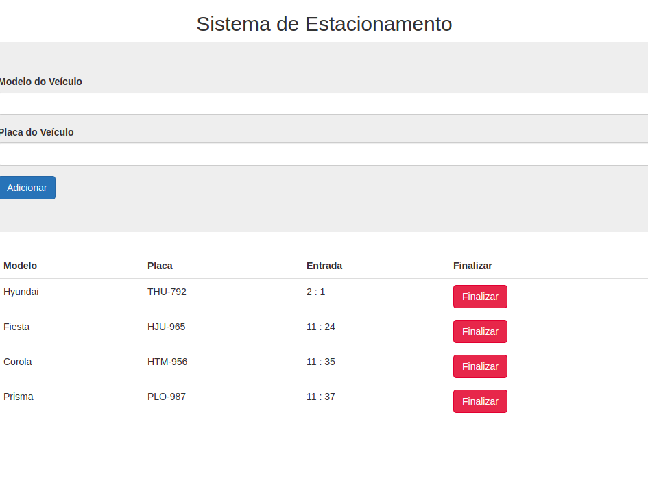

<h2 align="center">Sistema de estacionamento</h2>

🚩 Sistema de Estacionamento com o objetivo de registrar o horário de entrada dos e saída veículos. Contrado com cadastro de modelo e placa para melhor controle e gerenciamento do fluxo de carros do seu estacionamento.

<h4  id="status" align="center"> 
  Status do projeto 🚀 Finalizado 
</h4>

<h2 align="center"> Features </h2>

- [x] Cadastrar veículos
- [x] Registrar horário de entrada dos veículos
- [x] Registrar horário de saída dos veículos

<h2 align="center" > Screenshot da aplicação </h2>

<h2 align="center" id="tecnologias"> 🛠 Tecnologias </h2>

:heavy_check_mark: HTML5  
:heavy_check_mark: CSS3  
:heavy_check_mark: BOOTSTRAP  
:heavy_check_mark: Javascript  
:heavy_check_mark: API Web Storage

<h2 align="center" id="autor"> Autora </h2>

Feito com ❤️ por Keylane Silva 👋🏽 Entre em contato! 

